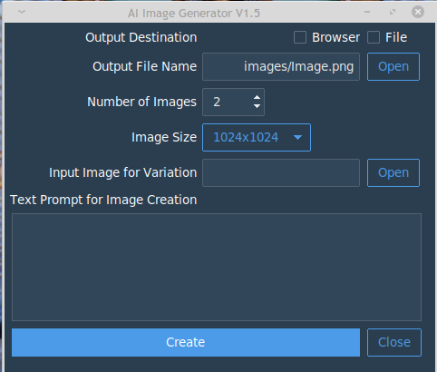

# aimgui
### AI Image generation and variation desktop GUI

aimgui.py is a desktop implementation of the openai API found at:

https://platform.openai.com/docs/api-reference/images/create-edit

It's a Python program that should be compatible with all the major
operating systems. By specifying a _prompt_ and an output image 
file location, you can gererate AI images. In addition, you can
specify for the output to go to your default web browser or
to files or both. Furthermore, you can run image variation
on an existing image file (with no prompt.)

A log file is updated with _prompt_ and image file names.


256x256 | 512x512 | 1024x1024  
These are the only image file sizes allowed for this model.





Before using this application Python 3.x must be installed.

To install Python go to https://www.python.org/downloads/.
Click Download Python 3.??? and follow the installation instructions.

Use the requirements.txt file to install any modules you may be missing.

```bash
pip3 install -r requirements.txt
or
pip install -r requirements.txt
```

You will also have to Sign Up at https://openai.com/api/ and create an API Key.
There is no cost to do so.

Before using the program you will need to set up an Environment Variable 
called 'GPTKEY' whoes value will be your OpenAI API Key.

---

